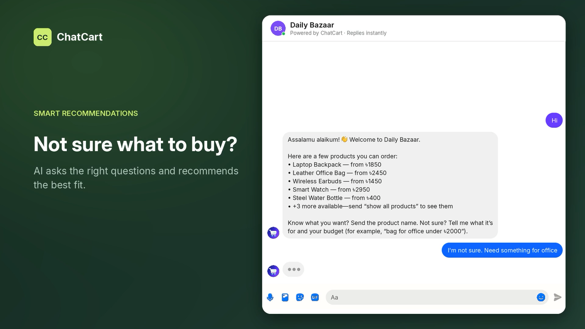
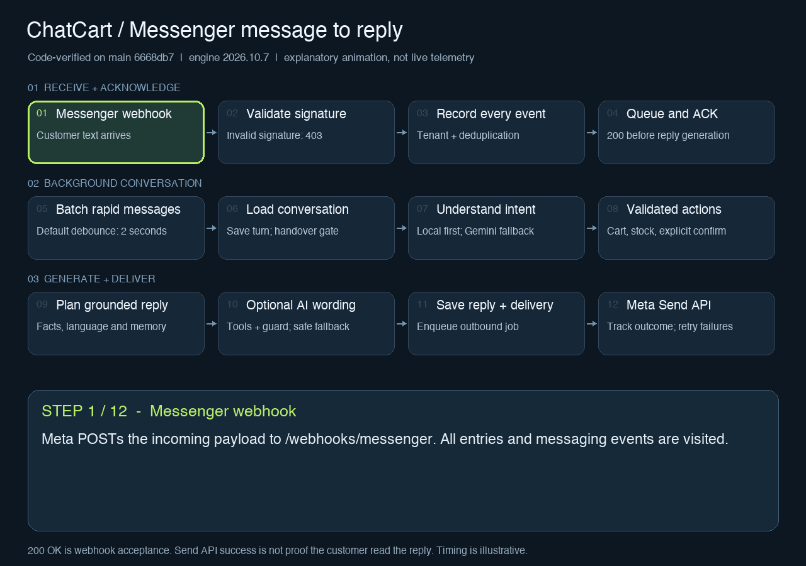

# ChatCart Conversational Commerce Platform

ChatCart helps businesses sell through messaging with minimal human staffing. It receives Messenger and WhatsApp webhooks, conducts English/Bengali/Banglish sales conversations, recommends catalog products, confirms durable orders, exposes an authenticated business dashboard, exports orders, and can submit confirmed orders to a delivery provider.

## Product demo

Watch the 62-second walkthrough to see customer product discovery, conversational ordering, the business dashboard, conversations, human takeover, orders, catalog management, and business setup.

[](docs/assets/ChatCart_Demo.mp4)

[Watch the demo](docs/assets/ChatCart_Demo.mp4) · [Download the MP4](docs/assets/ChatCart_Demo.mp4?raw=1) · [Open the live dashboard](https://chatcart-dashboard.pages.dev)

## How Messenger conversations work



The animation follows message receipt, signature validation, event recording and
deduplication, fast webhook acknowledgement, background batching, intent
classification, validated order actions, reply planning, optional AI wording,
and outbound delivery with retries.

This is a code-verified explanatory animation based on `main` commit
[`6668db7`](https://github.com/Khaled-Ahmmed-Anik/ChatCart/commit/6668db73091eb575fbccdcc6bf88a6adc29887c8),
not a live Messenger recording. Timing is illustrative; optional AI steps depend
on feature flags and credentials. HTTP `200 OK` acknowledges the webhook, while
Send API success does not prove the customer has read the reply.

[Download the GIF](docs/assets/messenger-flow.gif?raw=1) · [Read the detailed conversation flow](docs/conversation-system.md)

## Production status

The MVP is live on the following free-tier stack:

| Component | Provider | Production URL |
| --- | --- | --- |
| Dashboard, legal pages, and API proxy | Cloudflare Pages | [chatcart-dashboard.pages.dev](https://chatcart-dashboard.pages.dev) |
| Rails API, webhooks, and background jobs | Render | [chatcart-api-29oq.onrender.com](https://chatcart-api-29oq.onrender.com/ready) |
| PostgreSQL | Neon | Private managed database |

Public legal pages:

- [Privacy Policy](https://chatcart-dashboard.pages.dev/privacy)
- [Data Deletion](https://chatcart-dashboard.pages.dev/data-deletion)

The current production baseline is [`v0.1.0`](https://github.com/Khaled-Ahmmed-Anik/ChatCart/tree/v0.1.0). Render and Cloudflare Pages deploy automatically from `main`; Render's free service can take about a minute to wake after inactivity.

## Current capabilities

- Meta webhook verification and SHA-256 request-signature validation
- Messenger text-message ingestion and replies
- Strict business tenancy with per-business users, products, policies, channels, and delivery settings
- Role-based owner, admin, sales, fulfilment, and analyst access
- Product catalog with price, stock, tags, and active status
- Rich product knowledge, size/price/stock variants, and verified budget-aware recommendations
- Alias- and typo-aware product resolution, fixed/configurable combos, safe archiving, and reviewed URL imports
- Persistent conversations and message history
- Contextual conversation memory with multi-intent English, Bengali, and Banglish understanding
- Safe repeat orders, remembered-detail reuse, confidence-based clarification, and automatic seller handover
- Guided collection of product, quantity, name, phone, and address
- Durable confirmed orders with immutable item and price snapshots
- Dashboard analytics, order CSV export, conversation transcript, and human takeover
- Automatic or manual delivery submission with retryable background jobs
- A responsive React/TypeScript owner dashboard in `frontend/`
- A tenant-scoped GraphQL dashboard API with generated frontend operation types
- Seed catalog for the current ChatCart products

Messenger and WhatsApp Cloud API are implemented customer channels. Instagram is represented in the channel model but still requires its channel-specific webhook and send adapter.

Detailed implementation documentation:

- [Authentication and access lifecycle](docs/authentication-and-access.md) — sessions, revocation, account controls, and business suspension/disable behavior.
- [Conversation system](docs/conversation-system.md) — webhook flow, intent handling, memory, guided sales, checkout, recovery, delivery, and diagnostics.
- [Structured conversation planner](docs/structured-conversation-planner.md) — safe model tools, grounded natural replies, quality metrics, and staged rollout.
- [Interactive architecture diagrams](docs/architecture-diagrams.md) — production topology, conversation/order lifecycle, and intent/context resolution.
- [Tenant-scoped knowledge retrieval](docs/knowledge-retrieval.md) — product/policy indexing, lexical retrieval, citations, and the hybrid RAG boundary.
- [Conversation evaluation](docs/conversation-evaluation.md) — reviewed multilingual benchmark cases, quality thresholds, and the regression command.
- [Conversation action and customer-name safety](docs/conversation-safety.md) — explicit confirmation/cancellation commands, name validation, and safe evaluation-data handling.
- [Sector recommendations and multi-product orders](docs/multi-product-orders.md) — catalogue attributes, cart changes, shared checkout, stock checks, and rollout.
- [Meta production checklist](docs/meta-production-checklist.md) — publishing Messenger and WhatsApp integrations.
- [Free MVP deployment](docs/free-production-deployment.md) — Render, Neon, Cloudflare Pages, production secrets, verification, and releases.

## Requirements

- Ruby 3.4.7
- Bundler 2.6.9
- PostgreSQL
- An ngrok account for local Messenger testing
- A Meta app connected to a Facebook Page

This repository uses `mise` for the local Ruby runtime in development.

## Setup

```bash
cd backend
cp .env.example .env
mise exec -- bundle install
mise exec -- bin/rails db:prepare
mise exec -- bin/rails db:seed
```

Configure `backend/.env` with your own values:

```dotenv
MESSENGER_VERIFY_TOKEN=choose-a-private-verification-token
MESSENGER_PAGE_ACCESS_TOKEN=your-facebook-page-access-token
MESSENGER_APP_SECRET=your-meta-app-secret
NGROK_HOST=your-assigned-domain.ngrok-free.dev
PLATFORM_ADMIN_TOKEN=generate-a-long-random-token
DASHBOARD_ORIGIN=http://localhost:4173
```

For production, generate database-encryption keys with `bin/rails db:encryption:init` and add the three generated `ACTIVE_RECORD_ENCRYPTION_*` values to the environment. Development and test derive stable local keys from the Rails application secret.

Never commit `backend/.env` or real credentials.

## Run locally

Start Rails:

```bash
cd backend
mise exec -- bin/rails server
```

In another terminal, start the tunnel using the domain assigned to your ngrok account:

```bash
ngrok http --url=https://your-assigned-domain.ngrok-free.dev 3000
```

Install and start the React business dashboard in a third terminal:

```bash
cd frontend
npm install
npm run dev
```

Open `http://localhost:4173`, select the account level, and sign in with email and password. Local seed accounts are configured through `PLATFORM_ADMIN_EMAIL`, `PLATFORM_ADMIN_PASSWORD`, `CHATCART_OWNER_EMAIL`, and `CHATCART_OWNER_PASSWORD` in the ignored `backend/.env` file.

Create a business and its first owner through the platform-admin API. Set
`PLATFORM_ADMIN_SESSION` to the bearer token returned by `POST /auth/admin/login`.
The example password below is a placeholder; replace it with a unique password
of at least 12 characters and do not reuse it in production:

```bash
curl -X POST http://localhost:3000/admin/businesses \
  -H "Authorization: Bearer $PLATFORM_ADMIN_SESSION" \
  -H "Content-Type: application/json" \
  -d '{"business":{"name":"Demo Shop","slug":"demo-shop","category":"retail"},"owner":{"name":"Owner","email":"owner@example.com","password":"replace-with-a-unique-password"}}'
```

The owner can immediately use the supplied email and password. Authentication returns an opaque 12-hour session token; passwords are stored only as salted PBKDF2 derivations.

Check the application:

```bash
curl http://localhost:3000/up
curl http://localhost:3000/ready
curl http://localhost:3000/products
```

Configure the Meta Messenger callback URL as:

```text
https://your-assigned-domain.ngrok-free.dev/webhooks/messenger
```

Use the same `MESSENGER_VERIFY_TOKEN` value in Meta, subscribe the Page to the `messages` field, and keep both Rails and ngrok running during local testing.

Configure the WhatsApp Cloud API callback URL as:

```text
https://your-assigned-domain.ngrok-free.dev/webhooks/whatsapp
```

Use `WHATSAPP_VERIFY_TOKEN` during webhook verification, subscribe the WhatsApp Business Account to the `messages`
field, and configure the app secret, permanent access token, and Phone Number ID from Meta. Production publishing and
review steps are documented in [`docs/meta-production-checklist.md`](docs/meta-production-checklist.md).

## API endpoints

| Method | Path | Purpose |
| --- | --- | --- |
| `GET` | `/up` | Rails health check |
| `GET` | `/ready` | Database and Solid Queue readiness check |
| `GET` | `/products` | List active, in-stock products |
| `POST` | `/products` | Create a product |
| `GET` | `/conversations/lookup` | Retrieve a conversation and order state |
| `POST` | `/conversation_messages` | Exercise the conversation flow without Messenger |
| `GET` | `/webhooks/messenger` | Meta webhook verification |
| `POST` | `/webhooks/messenger` | Receive Messenger events |
| `GET` | `/webhooks/whatsapp` | Meta WhatsApp webhook verification |
| `POST` | `/webhooks/whatsapp` | Receive WhatsApp message and status events |
| `POST` | `/graphql` | Typed business dashboard queries and mutations |
| `GET` | `/api/analytics` | Business conversion and customer analytics |
| `GET` | `/api/orders` | Authenticated business order dashboard |
| `GET` | `/api/orders/export` | Export the business's orders as CSV |
| `GET` | `/api/conversations` | Conversation inbox and transcripts |
| `POST` | `/api/conversations/:id/handover` | Pause automation for human takeover |
| `GET/POST` | `/api/products` | Manage the current business's catalog |
| `GET/PATCH` | `/api/business_policy` | Manage sales and delivery knowledge |
| `GET/POST` | `/api/knowledge_documents` | Manage tenant-scoped manual FAQs and indexed sources |
| `GET` | `/api/knowledge_documents/status` | Inspect knowledge and embedding readiness |
| `GET` | `/api/knowledge_documents/preview` | Preview grounded retrieval for a customer question |
| `POST` | `/api/knowledge_documents/sync` | Refresh indexed product and policy knowledge |
| `GET/PATCH` | `/api/delivery_integration` | Configure order delivery submission |

Use `POST /auth/login` for business users and `POST /auth/admin/login` for platform administrators. All `/api` and `/admin` endpoints require the returned bearer session. Sessions expire after 12 hours; disabling a user or suspending/disabling its business revokes every affected session. Reactivation requires a fresh login. The original API-token path remains temporarily available for backward compatibility. See [Authentication and access lifecycle](docs/authentication-and-access.md) for the complete behavior.

The React dashboard uses GraphQL for its business context, analytics, and product catalog. Authentication, Meta webhooks, health checks, and CSV downloads remain REST endpoints. After changing the GraphQL schema or dashboard operations, regenerate the checked-in client types:

```bash
cd backend
mise exec -- bin/rails graphql:schema:dump
cd ../frontend
npm run codegen
npm run typecheck
```

## Tests and code quality

```bash
cd backend
mise exec -- bundle exec rails test
mise exec -- bundle exec rubocop --cache false
mise exec -- bin/brakeman --no-pager

cd ../frontend
npm run codegen
npm run typecheck
npm run lint
npm run build
```

## Project layout

```text
backend/   Rails API, database migrations, services, and tests
frontend/  React/Vite multi-page seller and platform-admin dashboard
```

The main application flow is implemented in:

- `backend/app/controllers/webhooks/messenger_controller.rb`
- `backend/app/controllers/webhooks/whatsapp_controller.rb`
- `backend/app/services/customer_message_recorder.rb`
- `backend/app/services/conversation_message_processor.rb`
- `backend/app/services/bot_reply_generator.rb`
- `backend/app/services/messenger_reply_sender.rb`
- `backend/app/services/whatsapp_reply_sender.rb`

## Contribution and release workflow

`main` is the protected production branch. Do not develop directly on it.

1. Update `main`, then create a `WC-###-description` feature branch.
2. Commit the scoped change and open a pull request whose title matches the branch name.
3. Wait for backend, frontend, lint, and security checks to pass.
4. Other contributors require an approval from `@Khaled-Ahmmed-Anik`, the repository code owner. The repository owner may merge their own PR using the configured PR-only bypass.
5. Merge the PR into `main`; direct pushes, force pushes, and deletion of `main` are blocked.
6. Verify the automatic Render and Cloudflare deployments, then create the next semantic release from GitHub Actions.

See [Free MVP deployment](docs/free-production-deployment.md#releasing-future-versions) for production verification, versioning, migrations, and rollback.

## Known next steps

- Implement the Instagram messaging adapter
- Add password recovery, optional MFA, and legacy API-token rotation/removal UX
- Add delivery-provider-specific adapters and WooCommerce synchronization
- Move the backend to always-on infrastructure before offering production uptime commitments
- Add production monitoring, alerting, backups, and recovery drills

## Production deployment

- [Current free MVP deployment: Render, Neon, and Cloudflare](docs/free-production-deployment.md)
- [Planned always-on Oracle migration](docs/oracle-production-deployment.md)
