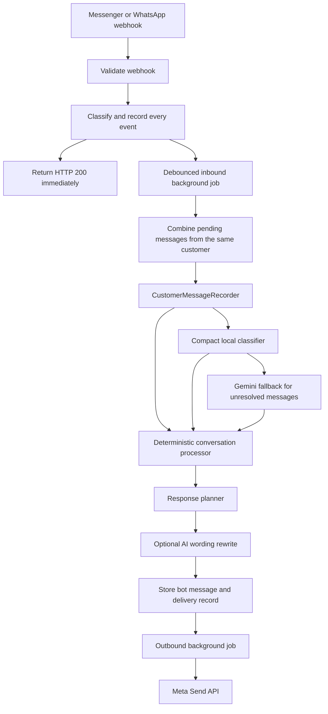

# ChatCart Conversation System

This document describes how customer conversations currently work in ChatCart. It reflects the implemented behavior on branch `WC-017-improve-conversation-recovery`, rather than a future design.

## 1. Purpose and scope

The conversation system is responsible for:

- receiving customer messages from Messenger and WhatsApp;
- validating, deduplicating, recording, and batching inbound events;
- understanding English, Bengali, and Banglish messages;
- answering product and business-policy questions;
- guiding customers through product discovery and comparison;
- collecting the information required to confirm an order;
- creating a permanent order after confirmation;
- optionally submitting that order to a configured delivery provider;
- handing a conversation to a seller when automation should stop; and
- sending replies reliably without making the webhook wait for AI or network calls.

The same core conversation services are shared across channels. Channel-specific code handles webhook payloads and outbound delivery.

## 2. End-to-end message flow



The webhook does not wait for conversation processing or Meta's Send API. This keeps acknowledgement fast and reduces duplicate retries from Meta.

## 3. Inbound webhook processing

### Messenger

The Messenger endpoint is `POST /webhooks/messenger`.

`Webhooks::MessengerController` performs these steps:

1. Verifies `X-Hub-Signature-256` with `MESSENGER_APP_SECRET`.
2. Iterates through every `entry` and every `messaging` event in the payload.
3. Classifies each event, including customer text, attachment, delivery receipt, read receipt, echo, or unknown event.
4. Resolves the correct business from the Facebook page's `ChannelConnection`.
5. Records the event with its external event ID for deduplication.
6. Enqueues customer-text events for background processing.
7. Returns `200 OK` without waiting for reply generation.

Messenger verification uses `GET /webhooks/messenger`, `MESSENGER_VERIFY_TOKEN`, and Meta's `hub.challenge` parameters.

### WhatsApp

WhatsApp follows the equivalent event-recording and background-processing design. It uses `WhatsappWebhookEvent`, `ProcessWhatsappEventJob`, `WhatsappDelivery`, and `SendWhatsappReplyJob`.

### Deduplication

External message IDs are recorded on webhook events. A repeated webhook delivery is marked as a duplicate rather than creating another customer message or reply.

### Debouncing and message batching

Messenger text processing waits for `MESSENGER_MESSAGE_DEBOUNCE_SECONDS`, which defaults to two seconds. When the job runs, it locks and combines all pending text events for the same business and sender.

For example, two quickly sent messages:

```text
The Club
30 ML, two bottles
```

can reach the conversation system as one message separated by a newline. Metadata records the batched message IDs and batch size.

## 4. Core conversation transaction

`CustomerMessageRecorder` is the main coordinator. It processes a customer turn inside a database transaction:

1. Find or create a conversation by business, channel, and external customer ID.
2. Store the customer message.
3. Stop automated processing if the conversation is already handed over.
4. Try the compact multilingual classifier first, then use `AiIntentClassifier` only when the local result is not confident.
5. Store safe classification metadata on the customer message.
6. Find the current pending order or create a new one when appropriate.
7. Process the message with `ConversationMessageProcessor`.
8. Synchronize the guided-sales stage.
9. Evaluate seller-handover rules.
10. Capture a permanent order if confirmation is complete.
11. Build the deterministic response plan.
12. Update conversation memory.
13. Optionally rewrite the planned wording with `AiConversationAssistant`.
14. Store the final bot message.

If Gemini is unavailable, times out, or fails, deterministic processing and fallback replies remain available.

## 5. Intent classification

`CompactIntentClassifier` is the fast first layer. It contains 20–40 balanced English, Banglish, and Bengali examples for each supported local intent and uses character n-gram plus token-overlap scoring. It handles common social, catalogue, product-information, recommendation, ordering, delivery, payment, handover, and after-sales questions without a network call. Ambiguous and low-confidence matches are rejected rather than guessed. Values expected by the active checkout step, such as a phone number or `10 ML`, bypass this classifier and continue through deterministic state collection.

The local classifier is evaluated with separate multilingual phrases. The automated quality gate currently requires at least 80% classification coverage and 72% correct intent accuracy. Adding training examples without passing this held-out check is not considered an improvement.

`AiIntentClassifier` sends Gemini:

- the current order status;
- safe remembered conversation state;
- available product names;
- the ten most recent messages; and
- the current customer message.

It expects structured JSON containing:

- primary intent;
- optional informational secondary intents;
- confidence;
- extracted entities;
- detected language;
- sentiment;
- clarification requirement; and
- possible intents when uncertain.

Supported intent groups are defined in `Constants::Intents`:

- social conversation;
- products and recommendations;
- ordering;
- order updates;
- payment and delivery; and
- after-sales support.

Phone-like strings are replaced with `[PHONE]` before being sent to Gemini. The original message is validated locally, so real phone numbers are not required in the AI prompt.

Locally classified turns use deterministic wording and do not call Gemini again for a rewrite. This keeps common replies fast and available during Gemini failures.

## 6. Deterministic processing order

`ConversationMessageProcessor` deliberately applies rules in this order:

1. Order update or correction requests.
2. High-confidence deterministic conversational behaviors.
3. AI-classified informational intent.
4. Combined checkout-detail collection.
5. The current pending-order state.
6. Additional explicitly extracted entities.

This order prevents an AI label from overriding a safe order mutation or a clearly recognized command.

Examples of deterministic behaviors include:

- start or repeat an order;
- defer or resume an order;
- reject or shortlist recommendations;
- request order details;
- ask for product lists, sizes, prices, stock, or comparisons;
- ask about weather suitability;
- express first-time uncertainty about a scent family;
- ask about discount, authenticity, trust, trials, or delivery price;
- request recommendations by budget or preferences; and
- request a human seller.

## 7. Pending-order state machine

Each active order moves through these states:

```text
collecting_product
  → collecting_variant, when a size or variant is required
  → collecting_quantity
  → collecting_name
  → collecting_phone
  → collecting_address
  → awaiting_confirmation
  → confirmed
```

An order can also become `cancelled` or be submitted to an external commerce/delivery system.

### Required confirmation data

An order is ready for confirmation only when it has:

- an available product;
- a selected variant when variants exist;
- a positive quantity;
- customer name;
- valid phone number; and
- delivery address.

Bangladesh phone numbers are accepted in local `01XXXXXXXXX` form or `8801XXXXXXXXX` form. AI-redacted phone entities are ignored in favor of locally validated raw input.

### Combined details

The customer may provide comma-separated checkout details in one message, such as:

```text
Anik, 01712345678, Badda, Dhaka
```

The processor saves every valid field and asks only for what remains missing.

### Corrections

Customers may change product, variant, quantity, name, phone, or address. Changes are recorded in `PendingOrder#change_history`. Corrections work during checkout and during review of a confirmed-but-not-submitted order.

Examples:

```text
change quantity to 3
change phone to 01712345678
change name to Anik
change address to Badda, Dhaka
```

Explicit confirmation is required at the confirmation step. A casual acknowledgement such as `okay` does not confirm an order from an unrelated state.

### Context switches

An informational side question does not erase the active checkout state. The system answers the question, then repeats the exact missing order question. It also counts consecutive context switches. After repeated side questions, it names the saved product and variant and asks whether the customer wants to continue it, change it, or pause it. Completing the next order step resets that counter.

## 8. Product understanding

`ProductResolutionService` resolves products using:

- exact product names;
- compact forms without spaces;
- aliases and searchable names;
- multi-word product names;
- minor spelling errors;
- recent product context for pronouns such as `this`, `eta`, or `oita`; and
- ambiguity detection when a short term matches multiple products.

If a name is ambiguous, the bot asks the customer to choose among a small set instead of silently selecting one.

### Variants and ordinal selections

The system remembers the options most recently shown. Customers can select with:

- a name: `30 ML`;
- a number: `2`;
- a position: `second`, `2nd`, or `last one`; or
- relative language: `small`, `medium`, `large`, or `best value`.

Every newly displayed recommendation or variant list replaces the active selectable options. This prevents `2nd` from accidentally selecting an older catalogue entry.

## 9. Guided sales and recommendations

`GuidedSalesConversation` tracks these stages:

```text
discover → compare → select → configure → checkout → confirm → complete
```

Its context can contain:

- last recommended product IDs and offer snapshots;
- rejected product IDs;
- shortlisted products; and
- a suspended order that can be resumed after browsing.

### Preference memory

Shopping preferences can include:

- single perfume or combo;
- recipient or audience;
- scent families;
- scent families to avoid;
- occasion;
- performance or projection preference;
- minimum and maximum price; and
- preference for cheaper, premium, stronger, or softer alternatives.

### Adaptive clarification

The recommendation service changes its behavior based on available information:

- no useful preference: ask whether the customer wants a single perfume or combo;
- one useful preference: ask one narrowing question, such as occasion or budget;
- two or more useful dimensions: recommend immediately;
- explicit budget or comparative direction: recommend immediately.

Recommendations use only active, in-stock products and variants. Rejected products are excluded. A recommendation may include a short grounded explanation such as `matches your oud preference` or `suited to wedding` when product data supports it.

### Avoiding repetition

If a customer repeats the same preference after receiving recommendations, the bot gives a concise numbered reminder instead of repeating the same long recommendation block.

### Contextual product questions

The last referenced product supports follow-up questions such as:

```text
longevity kemon?
10ml price koto?
kon weather er jonno perfect?
```

Focused questions receive focused answers. A size-price question does not append the complete catalogue.

## 10. Business facts and objection handling

Commercial claims must come from product data or configured business policy. The assistant must not invent discounts, guarantees, delivery charges, authenticity claims, return conditions, or trial availability.

Business Settings currently supports:

- payment methods;
- cash on delivery;
- delivery charges, areas, and times;
- return policy;
- authenticity statement;
- discount policy;
- sample or trial policy;
- trust, reviews, or proof information;
- bulk-order policy; and
- additional information.

When a policy is missing, the bot says it cannot promise or verify the requested fact and offers seller confirmation or a safe alternative.

Statements such as `woody try kori nai kokhon o` are treated as first-time-use hesitation, not automatically as a request for a free sample. The bot suggests starting gently or using the smallest available size and asks about preferred strength.

## 11. Response planning and wording

`BotReplyGenerator` creates the factual base reply. `ConversationResponsePlanner` then:

- combines genuine secondary informational requests;
- prevents unrelated prompts from being mixed into focused answers;
- remembers pending questions;
- returns to an interrupted checkout step when useful;
- preserves the customer's established English, Bengali, or Banglish preference;
- avoids switching language because of a one-word product response; and
- remembers forms of address such as `bhai` when the customer uses them.

`AiConversationAssistant` may rewrite the deterministic response to sound more natural. The deterministic response remains the fallback and source of truth. The rewrite must not change order facts, prices, stock, policy, or workflow instructions.

## 12. Clarification and seller handover

The first unclear message receives a focused clarification based on likely intents or the current order step.

If confusion repeats, the customer receives explicit choices:

1. Choose or find a product.
2. Continue or change an order.
3. Ask about delivery or payment.
4. Talk to the seller.

`ConversationEscalationPolicy` hands the conversation to a seller when:

- the customer explicitly requests a human; or
- confusion or complaint reaches the configured repeated-problem threshold, currently three occurrences.

On handover:

- conversation status becomes `handed_over`;
- the reason is stored safely;
- a handover summary is generated; and
- future customer messages are recorded without automatic bot replies until the seller returns control.

## 13. Order capture and delivery integration

After explicit confirmation, `OrderCaptureService` creates a permanent `Order` and order items from the pending order.

If the business has an active delivery integration:

1. A `DeliverySubmission` is created.
2. `SubmitDeliveryJob` sends the order to the configured provider.
3. Temporary failures retry up to five times with polynomial backoff.
4. Successful submissions store the provider reference and submission time.
5. Permanent failures are recorded without retrying forever.

## 14. Outbound channel delivery

Messenger and WhatsApp replies have delivery records containing:

- status;
- attempt count;
- response code;
- last safe error;
- external message ID where available; and
- delivery timestamp.

Temporary failures such as timeouts, HTTP 5xx responses, and rate limiting are retried up to five times. Permanent errors, such as an invalid recipient or access token, are stored as failed.

Access tokens and app secrets are not included in application logs.

## 15. Conversation state reference

Important keys in `Conversation#conversation_state` include:

| Key | Purpose |
| --- | --- |
| `preferred_language` | English, Banglish, or Bengali continuity |
| `preferred_tone` | Friendly or calm/helpful response tone |
| `address_preference` | Customer-requested address such as `bhai` |
| `pending_question` | Current product or checkout information expected |
| `last_intent` / `last_outcome` | Most recent classified intent and deterministic outcome |
| `last_referenced_product` | Product used for contextual follow-up questions |
| `last_offered_options` | Exact active product or variant choices for ordinal selection |
| `shopping_preferences` | Remembered discovery and recommendation preferences |
| `guided_sales` | Sales stage, recommendations, rejections, shortlist, and suspended order |
| `intent_history` | Recent decisions used for recovery and debugging |
| `known_customer` | Safe summary of collected customer information |

## 16. Important models and services

| Component | Responsibility |
| --- | --- |
| `Conversation` | One customer thread per business and channel |
| `Message` | Customer and bot transcript entries |
| `PendingOrder` | Mutable checkout state |
| `Order` / `OrderItem` | Confirmed order record |
| `CustomerMessageRecorder` | Transactional conversation coordinator |
| `AiIntentClassifier` | Structured multilingual intent classification |
| `ConversationMessageProcessor` | Deterministic actions and state transitions |
| `ConversationResponsePlanner` | Context, interruption, and language planning |
| `BotReplyGenerator` | Grounded deterministic replies |
| `AiConversationAssistant` | Optional natural-language rewrite |
| `ConversationMemory` | Safe persistent conversation context |
| `GuidedSalesConversation` | Sales-stage and recommendation context |
| `ProductResolutionService` | Product-name and contextual reference matching |
| `ProductRecommendationService` | Budget and preference-based offer ranking |
| `ConversationEscalationPolicy` | Human-handover decision |

## 17. Configuration

Important environment variables include:

| Variable | Purpose |
| --- | --- |
| `MESSENGER_APP_SECRET` | Messenger webhook signature verification |
| `MESSENGER_VERIFY_TOKEN` | Meta webhook setup challenge |
| `MESSENGER_PAGE_ACCESS_TOKEN` | Fallback Messenger Send API token |
| `MESSENGER_MESSAGE_DEBOUNCE_SECONDS` | Delay used to combine rapid customer messages |
| `WHATSAPP_ACCESS_TOKEN` | Fallback WhatsApp API token |
| `GEMINI_API_KEY` | Enables intent classification and optional rewriting |
| `GEMINI_MODEL` | Overrides the default Gemini model |

Per-business channel tokens should normally be stored in `ChannelConnection`, rather than relying on global fallback environment variables.

## 18. Testing and diagnostics

Automated tests cover:

- correct and invalid webhook signatures;
- multi-entry and multi-event payloads;
- duplicate external message IDs;
- read, delivery, echo, attachment, and unsupported events;
- fast webhook acknowledgement;
- background inbound and outbound processing;
- temporary retry and permanent delivery failure;
- multilingual intent classification fallbacks;
- complete checkout and confirmation;
- combined customer details and phone validation;
- repeat orders and order corrections;
- multi-word products, variants, combos, and ordinal choices;
- recommendation refinement, rejection, and shortlist behavior;
- contextual price, performance, weather, and size questions;
- repeated misunderstanding and seller handover; and
- grounded objection handling.

Useful local checks:

```bash
cd backend
mise exec -- bin/rails test
mise exec -- bin/rubocop
mise exec -- bin/brakeman -q
mise exec -- bin/rails zeitwerk:check
```

For a webhook problem, inspect these records in order:

1. `MessengerWebhookEvent` or `WhatsappWebhookEvent` — did the message arrive and process?
2. `Conversation` and `Message` — was a customer message and bot reply created?
3. `MessengerDelivery` or `WhatsappDelivery` — was outbound delivery attempted?
4. delivery status, attempt count, response code, and safe last error;
5. ngrok or the deployed public endpoint — can Meta currently reach the application?

## 19. Current boundaries

- Product advice is only as accurate as the product descriptions, attributes, variants, prices, and stock stored by the business.
- Business-policy answers are only available when administrators configure them.
- Gemini improves classification and wording but does not replace deterministic order validation.
- Automated handover records and summarizes the request; a seller-facing notification workflow can be expanded later.
- Messenger and WhatsApp are implemented. Instagram can reuse the shared conversation core but still requires its channel-specific production integration and Meta permissions.

When conversation behavior changes, update this document together with the relevant regression tests.
